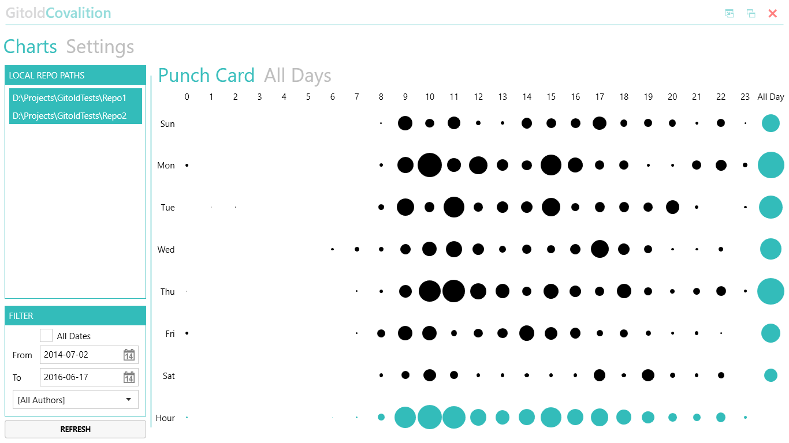
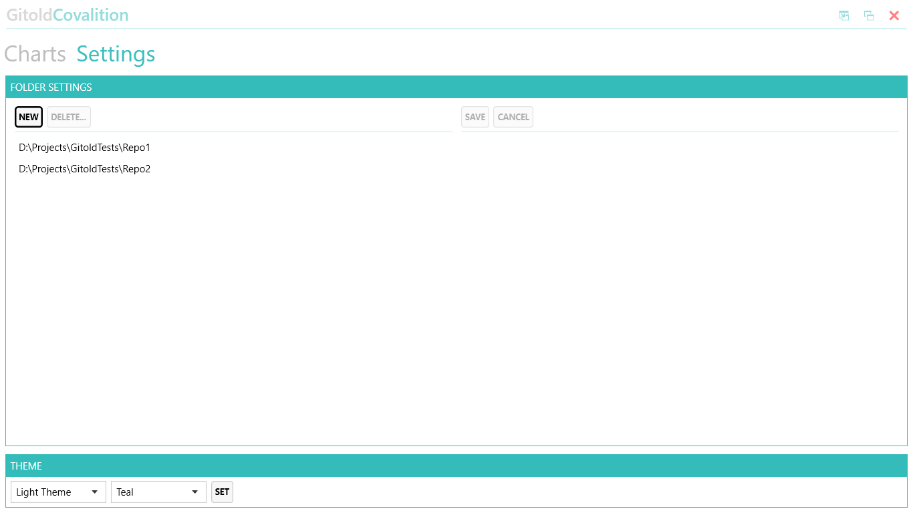

# Gitold.Covalition 1.2 #
Local Git Repos Analyzer

## Project Description ##

Creates a punch card for your local git repository

### System Requirements ###

* For use: .NET Framework 4.6
* For development: Visual Studio 2015

## Installation ##

You can download and install this application from: https://github.com/covalition/gitold/releases

## Screenshots ##

Main screen

Options

